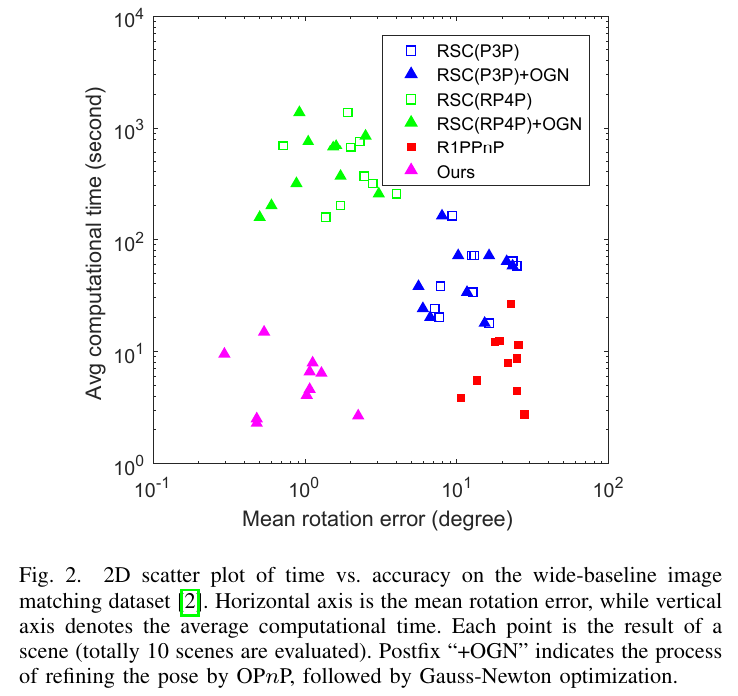
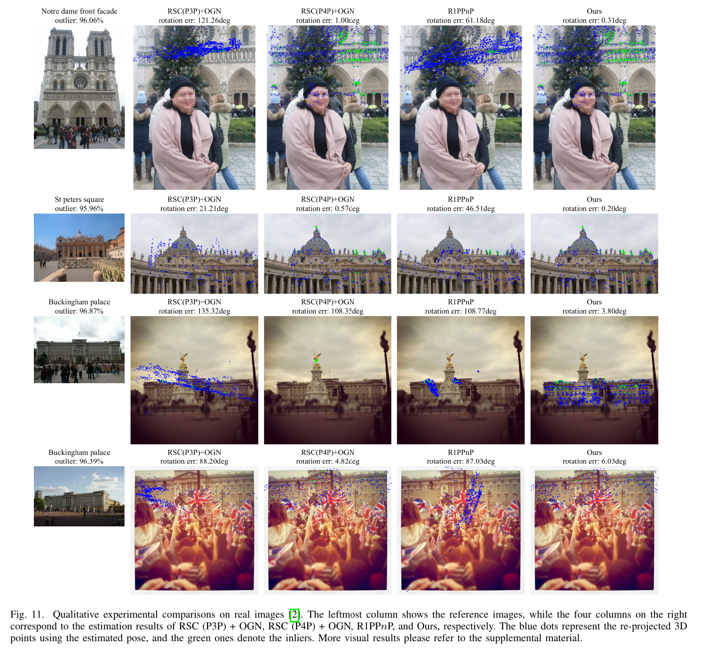
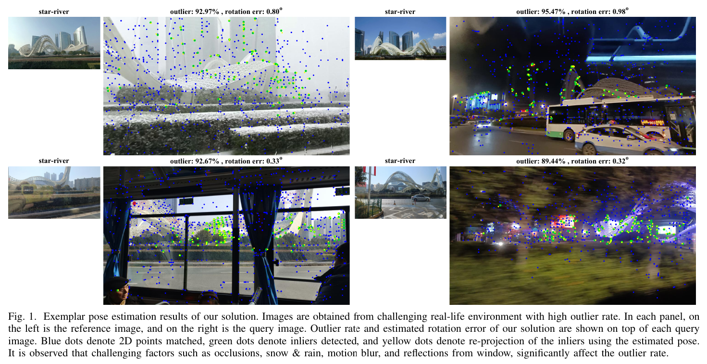
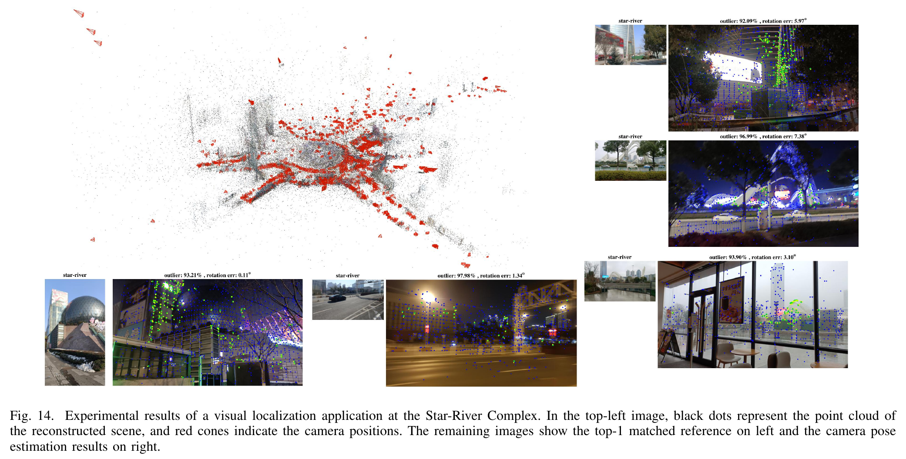

# A Hough Voting based 2-Point RANSAC Solution to the Perspective-n-Point Problem

Chi Xu, Tingrui Guo, Yuan Huang, Li Cheng

## Abstract

Perspective-n-point is a fundamental problem in multi-view geometry, yet two critical challenges persist: (1) The issues of high outlier rate and near degenerate cases exert a substantial impact on the robustness of existing PnP methods. In the worst-case where both issues are in presence, existing methods tend to either produce erroneous results or become computationally prohibitive. (2) Conventionally, the hypothetical pose with the maximum inlier-set is assumed to be correct. However, it remains unclear whether this assumption holds when the outlier rate approaches ultra-high levels, and along this line what is the maximum amount of outliers that can be robustly handled. To address these challenges, this paper proposes a novel Hough voting based 2-point RANSAC solution. To our knowledge, it is the first PnP solution capable of accurately and efficiently handling high outlier rates in near-degenerate cases. Extensive empirical evaluations have been conducted using the proposed approach, with a particular focus on a systematic examination under ultra-high outlier rates. The results show that, on random synthetic data, our approach works robustly even when dealing with up to 99% outliers. Meanwhile on real-world datasets, the maximum inlier-set assumption oftentimes fails when the outlier rate exceeds 97%, as the incorrect hypothetical poses may yield more inliers than the ground-truths. Our dataset and source code are to be made available at [https://github.com/xuchi7/RPnP_plusplus].

## Source Code

Comming soon ...

## Datasets

Please download the files via the links below, then unzip the file to the root directory of this repository.

- Synthetic data [comming soon ...]()
- Real data [comming soon ...]()

- Star-River Complex [comming soon ...]()

